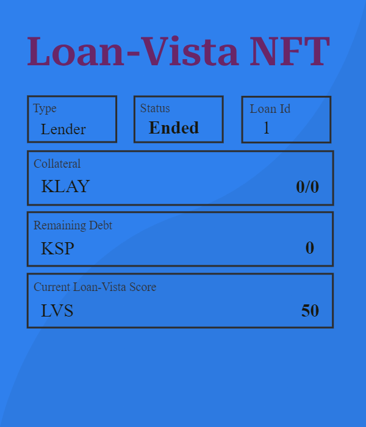
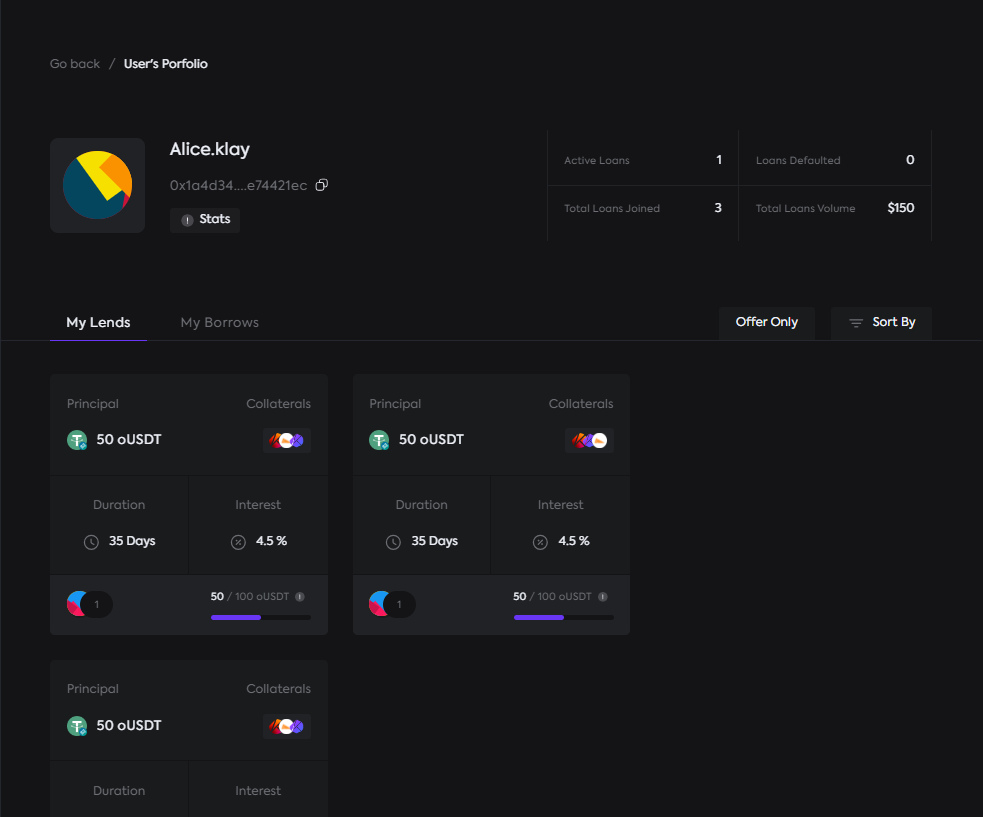
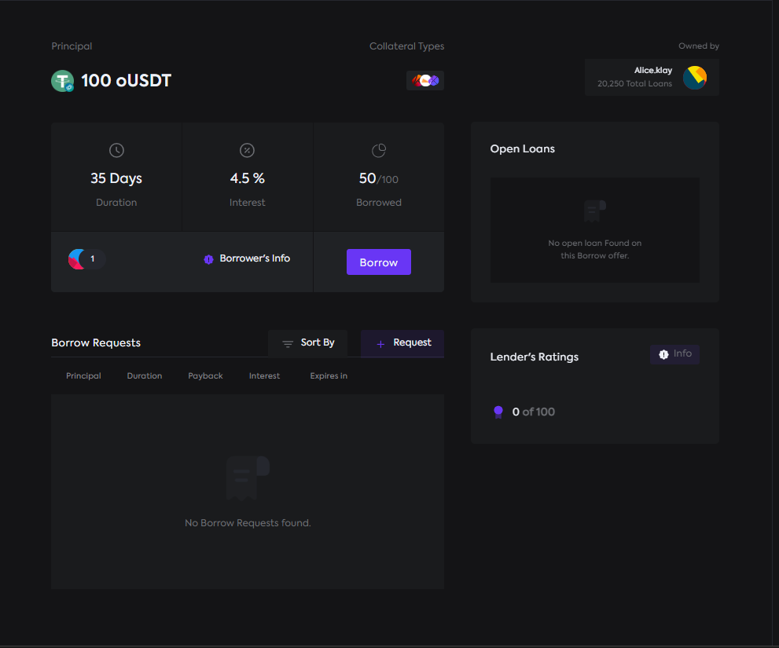
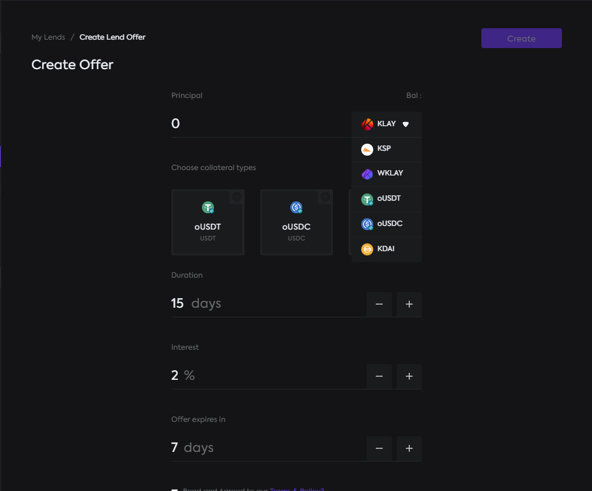

<a name="readme-top"></a>


<!-- PROJECT LOGO -->
<br />
<div align="center">
  <a href="https://github.com/startup-dreamer/LoanVista/blob/master/README.md">
    
  </a>

  <h3 align="center">Loan-Vista</h3>

  <p align="center">
Empower Your Financial Horizon with Loan Vista: Redefining Peer-to-Peer Lending!
    <br />
    <a href="https://github.com/startup-dreamer/LoanVista/blob/master/README.md"><strong>Explore the docs »</strong></a>
    <br />
    <br />
    <a href="">View Demo</a>
    ·
    <a href="https://github.com/startup-dreamer/LoanVista/issues">Report Bug</a>
    ·
    <a href="https://github.com/startup-dreamer/LoanVista/issues">Request Feature</a>
  </p>
</div>


## Table of Contents
- [Introduction](#introduction)
- [User Flow](#user-flow)
- [Key Features](#key-features)
- [Built With](#built-with)
- [Screenshots](#demo-screenshots)
- [Future Work](#future-work)
- [Challenges](#challenges-we-ran-into)
- [Contributing](#contributing)
- [Getting Started](#getting-started)
- [Contact](#contact)
- [Acknowledgments](#acknowledgments)


<!-- ABOUT THE PROJECT -->

## Introduction:
Loan Vista redefines peer-to-peer lending, allowing users to personalize loans by choosing collateral, interest rates, and even specific crypto assets. Operating without intermediaries ensures both lenders and borrowers benefit from potentially favorable rates. Future plans include introducing financial NFTs for unique receipts, enabling trading on secondary markets, and exploring derivatives and structured financial products. Key features for lenders involve structured terms, decentralized asset vaults, on-chain matching, and comprehensive loan management. Borrowers enjoy terms structuring, offer bidding, permissionless borrowing, and customized repayment options, providing a flexible and empowering financial ecosystem.

## User Flow:


### For Lenders:

- **Terms Crafting:** Design loan offers with preset terms, defining principal amounts, collateral types, loan duration, and interest rates.
- **Secure Asset Vaulting:** Safeguard your invested principal within a decentralized vault, ensuring a trustworthy escrow between lenders and borrowers.
- **Seamless On-Chain Matching:** Effortlessly connect and finalize loan offers with borrowers, with every transaction recorded and verifiable on the blockchain.
- **Comprehensive Loan Management:** Attain complete control over crafted loan offers, from settling borrow requests to claiming repayments and managing asset vaults—all accomplished on-chain.

### For Borrowers:

- **Tailored Terms Creation:** Develop loan offers with predetermined terms, outlining required principal amounts, loan duration, and interest rates as proposals to potential lenders.
- **Direct Offer Bidding:** Request borrow loan offers directly, aligning terms with initially presented lending loan offers by lenders.
- **Permissionless Borrowing:** Access principals from lender-created loan offers seamlessly, meeting specified loan terms without requiring permission.
- **Flexible Repayment Options:** Easily reevaluate collateralized assets for repayments, offering borrowers the choice of proportional payments or settling the loan within the specified duration.

## Key Features:

- Loan Vista offers a peer-to-peer lending platform, giving you the power to create a tailored solution for your specific needs.
- You have the freedom to select collateral, interest rates, duration, and the crypto asset that aligns with your preferences.
- It operates on a peer-to-peer basis without intermediaries, each party has the opportunity to secure a more favorable rate.
- Furthermore, In near future platform will generates a unique receipt in the form of financial NFTs for both parties involved (lender or borrower).
- This key feature will allow you to trade your portion of the agreement on secondary markets.
- This feature opens up a wide range of possibilities, including derivatives, structured products, and the option for users to exit their agreements at market rates.

<p align="right">(<a href="#readme-top">back to top</a>)</p>


## Built With

### Klaytn's Spec

#### Pool
- [Lending-Pool](https://baobab.klaytnfinder.io/account/0x9EDdd92cF5b7ff87eaf8ac9483DFF5BEbF69211d) (Klaytn tesetnet deployment link) `0x9EDdd92cF5b7ff87eaf8ac9483DFF5BEbF69211d`
#### Managers
- [Loan-Manager](https://baobab.klaytnfinder.io/account/0x43777c2Be846592E607dDb1D4fF37f9e3d696764) (Klaytn tesetnet deployment link) `0x43777c2Be846592E607dDb1D4fF37f9e3d696764`
- [Offer-Manager](https://baobab.klaytnfinder.io/account/0x618D96e5E9FFa25B27015c12CD08AeD1a349785c) (Klaytn tesetnet deployment link) `0x618D96e5E9FFa25B27015c12CD08AeD1a349785c`
- [Fee-Manager](https://baobab.klaytnfinder.io/account/0x9e2dCF8a2FB63a243714F09A086D11Ede9EfEF05) (Klaytn tesetnet deployment link) `0x9e2dCF8a2FB63a243714F09A086D11Ede9EfEF05`
#### Utils
- [Activity](https://baobab.klaytnfinder.io/account/0xBa86c386b9625E8d928207E478a6DDc6A3B10799) (Klaytn tesetnet deployment link) `0xBa86c386b9625E8d928207E478a6DDc6A3B10799`
- [Price-Feed](https://baobab.klaytnfinder.io/account/0xdEcc3098eAAe386AB455C4b0b7bCE8513fB663d3) (Klaytn tesetnet deployment link) `0xdEcc3098eAAe386AB455C4b0b7bCE8513fB663d3`
- [LoanVista-Score](https://baobab.klaytnfinder.io/account/0x5808DDC08C22aFDc6436A9Ab34Fa7e21267017A5) (Klaytn tesetnet deployment link) `0x5808DDC08C22aFDc6436A9Ab34Fa7e21267017A5`
- [LoanToValue-Ratio](https://baobab.klaytnfinder.io/account/0xa61bA9401bb419B9B2d489ea090A6Bd5871e22d7) (Klaytn tesetnet deployment link) `0xa61bA9401bb419B9B2d489ea090A6Bd5871e22d7`

### Other Spec

- [React][react-url]
- [Hardhat](https://hardhat.org/)
- [Foundry](https://book.getfoundry.sh/)
- [Express](https://expressjs.com/)


<p align="right">(<a href="#readme-top">back to top</a>)</p>

## Demo Screenshots

<div align="center">

### NFT




### Portfolio



### Lending/Borrowing Market



### Create Offer



</div>

## Future Work

**NFT Recipt:** e plan to integrate a dynamic NFT receipt into the protocol, unlocking opportunities in the secondary market, such as derivatives and structured products. This will enhance the Klaytn Ecosystem. The contract is completed but not yet deployed or integrated; find it in the `contracts/src/archive` directory.


**NFTs as Collateral:**
We plan to integrate P2P NFT Collateralized loans into Loan-Vista. This addition will enhance the usability and capital efficiency of the protocol, benefiting the entire DeFi ecosystem.


## Challenges we ran into

- Creating such a big project with so many technicalities was difficult as we are committed to deploy it to Klaytn's mainnet and see this work (but currently the contracts are deployed to testnet only).

- We first planned to add the NFT receipt to the protocol, but due to time constraints, we were not able to do so. However, as soon as the judging is over, we are planning to integrate it into the protocol.

<!-- CONTRIBUTING -->
## Contributing

Contributions are what make the open source community such an amazing place to learn, inspire, and create. Any contributions you make are **greatly appreciated**.

If you have a suggestion that would make this better, please fork the repo and create a pull request. You can also simply open an issue with the tag "enhancement".
Don't forget to give the project a star! Thanks again!

1. Fork the Project
2. Create your Feature Branch (`git checkout -b feature/AmazingFeature`)
3. Commit your Changes (`git commit -m 'Add some AmazingFeature'`)
4. Push to the Branch (`git push origin feature/AmazingFeature`)
5. Open a Pull Request

<p align="right">(<a href="#readme-top">back to top</a>)</p>


<!-- GETTING STARTED -->
## Getting Started

This is an example of how you may give instructions on setting up your project locally.
To get a local copy up and running follow these simple example steps.

### Prerequisites

This is an example of how to list things you need to use the software and how to install them.
* npm
  ```sh
  npm install npm@latest -g
  ```

### Installation

_Below is an example of how you can instruct your audience on installing and setting up your app. This template doesn't rely on any external dependencies or services._

1. Get a free API Key at [https://example.com](https://example.com)
2. Clone the repo
   ```sh
   git clone https://github.com/your_username_/Project-Name.git
   ```
3. Install NPM packages
   ```sh
   npm install
   ```
4. Enter your API in `config.js`
   ```js
   const API_KEY = 'ENTER YOUR API';
   ```

<p align="right">(<a href="#readme-top">back to top</a>)</p>


<!-- LICENSE -->
## License

Distributed under the MIT License. See `LICENSE.txt` for more information.

<p align="right">(<a href="#readme-top">back to top</a>)</p>


<!-- CONTACT -->
## Contact

Your Name - [@Krieger]([https://twitter.com/your_username](https://twitter.com/Startup_dmr)) - prsumit35@gmail.com

Project Link: [https://github.com/startup-dreamer/LoanVista](https://github.com/startup-dreamer/LoanVista)

<p align="right">(<a href="#readme-top">back to top</a>)</p>


<!-- ACKNOWLEDGMENTS -->
## Acknowledgments

Thanks to all the sponsors and organizers for making **Klaymakers 2023 Global Virtual Hackathon** possible.
Mentors have been helping us, giving reviews with various aspects of the project and we are grateful to them for that.

* [Klaytn Docs](https://docs.klaytn.foundation/)
* [Awesome Klaytn](https://github.com/klaytn/awesome-klaytn)
* [Dev Tutorials](https://klaytn.foundation/blog/?blog_category=tutorials#blogs)
* [Kaikas Browser Extension](https://chrome.google.com/webstore/detail/kaikas/jblndlipeogpafnldhgmapagcccfchpi)